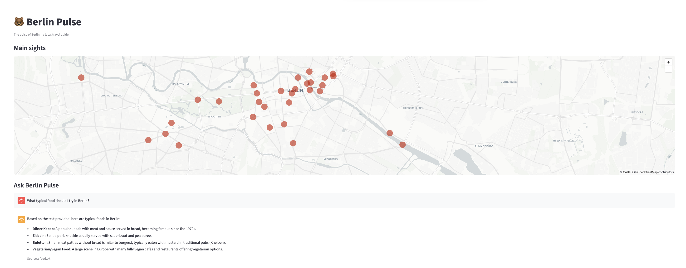
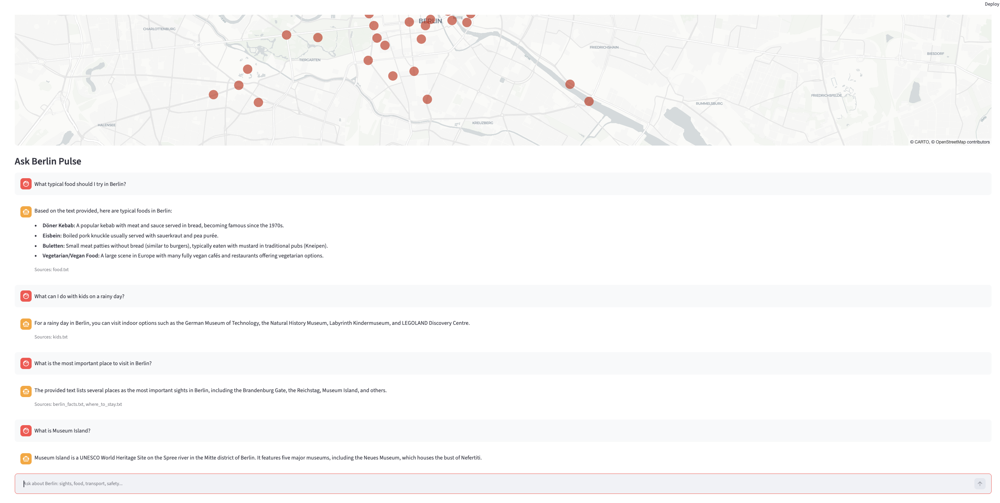
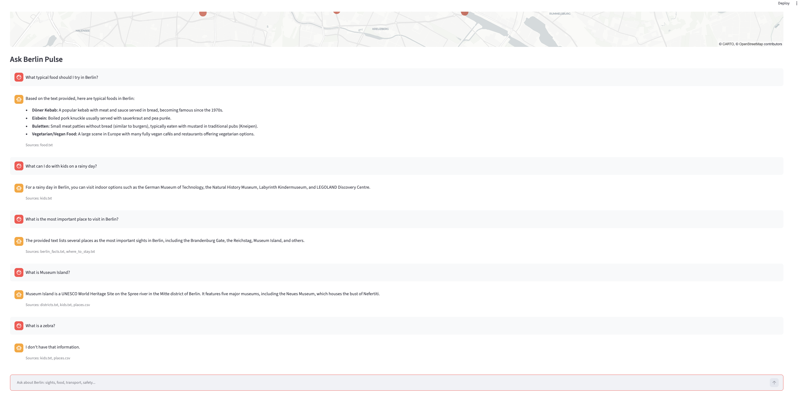

# Berlin Pulse – The pulse of Berlin

Berlin Pulse is a local AI travel guide for tourists. It combines a Streamlit map of Berlin's
main sights with a chat that answers questions using a curated knowledge base and a local LLM
(Ollama). Everything runs on your own computer: no paid APIs, and no data leaves your machine.



---

## The problem

Tourists in Berlin often jump between many websites, apps and guidebooks to find basic
information: what to see, what to eat, how public transport works or which areas are safe.
General AI chatbots can help, but they sometimes invent facts, and it is hard to check
where their answers come from.

## The solution

Berlin Pulse is a pocket guide that answers tourist questions using a curated knowledge base
written and fact-checked by a Berlin tour guide. It combines a map of 37 main sights with a
chat that only answers from these documents and shows the source of each answer.





---

## How it works (RAG pipeline)

1. **Load and chunk:** the documents are split into 104 chunks (one idea per paragraph).
2. **Embed and store:** each chunk is turned into a vector with `nomic-embed-text` and stored in ChromaDB.
3. **Retrieve:** the user's question is embedded, and the 4 closest chunks are found by meaning.
4. **Generate:** a local LLM (`qwen3.5:2b`) writes the answer using only those chunks.
5. **Cite:** the app shows the source files behind each answer.

## Tech stack

| Component | Tool |
|---|---|
| Frontend | Streamlit |
| LLM | Ollama – `qwen3.5:2b` |
| Embeddings | Ollama – `nomic-embed-text` |
| Vector database | ChromaDB |
| Data | pandas |

## Key product decisions

- **Local and private:** everything runs on the user's computer with Ollama. No paid APIs, and no data leaves the machine.
- **Curated content over web data:** a smaller knowledge base that is fact-checked is more reliable than a large one that is not.
- **Grounded answers:** if the information is not in the documents, the app says so instead of inventing an answer.
- **Areas, not hotels:** the knowledge base describes neighbourhoods instead of hotels, because prices and availability change too often.

## Limitations and next steps

- The knowledge base is static, so it needs manual updates (for example, ticket prices).
- A small local model is fast and free, but less precise than large cloud models.
- Next steps: answers in more languages, filtering the map by category, and evaluating answer quality with a test set of questions.

---

## How to run

**Requirements:** Python 3.10 or newer, and [Ollama](https://ollama.com) installed and running.

1. Download the two models:

   ```bash
   ollama pull qwen3.5:2b
   ollama pull nomic-embed-text
   ```

2. Create a virtual environment and install the libraries:

   ```bash
   python3 -m venv .venv
   source .venv/bin/activate
   pip install -r requirements.txt
   ```

3. Build the knowledge base (embeddings + ChromaDB):

   ```bash
   python ingest.py
   ```

4. Start the app:

   ```bash
   streamlit run app.py
   ```

The app opens at `http://localhost:8501`.

---

## Knowledge base

| File | Content |
|---|---|
| `docs/places.csv` | 37 main sights: district, category, coordinates and description (also used for the map) |
| `docs/berlin_facts.txt` | Population, currency, language, transport, best time to visit, tipping |
| `docs/districts.txt` | One place of interest per district (12 districts) |
| `docs/places/` | Detailed files, one per place (currently Charlottenburg Palace) |
| `docs/food.txt` | Typical food and sweets |
| `docs/kids.txt` | Activities for children |
| `docs/where_to_stay.txt` | Neighbourhoods to stay in |
| `docs/safety.txt` | Safety tips and emergency numbers |

## Adding content

1. **Lines that start with `#` are instructions.** The app ignores them.
2. **One idea per paragraph, separated by an empty line.** Each paragraph becomes a *chunk*.
3. **Each paragraph must make sense on its own.** Repeat the place name and "Berlin" in each
   paragraph, because the retrieval step only sees the chunk, not the whole document.
4. **Write in English.** The app and its users work in English.
5. **Fact-check everything.** If a fact is wrong here, the app will repeat it with confidence.
6. **New detailed place?** Copy `docs/places/_template.txt` and rename it (for example `reichstag.txt`).
7. **Coordinates for `places.csv`:** in Google Maps, right-click on a place. The first line shows
   the coordinates (for example `52.5163, 13.3777`): the first number is `lat`, the second is `lon`.

After changing any document, run `python ingest.py` again to rebuild the knowledge base.
